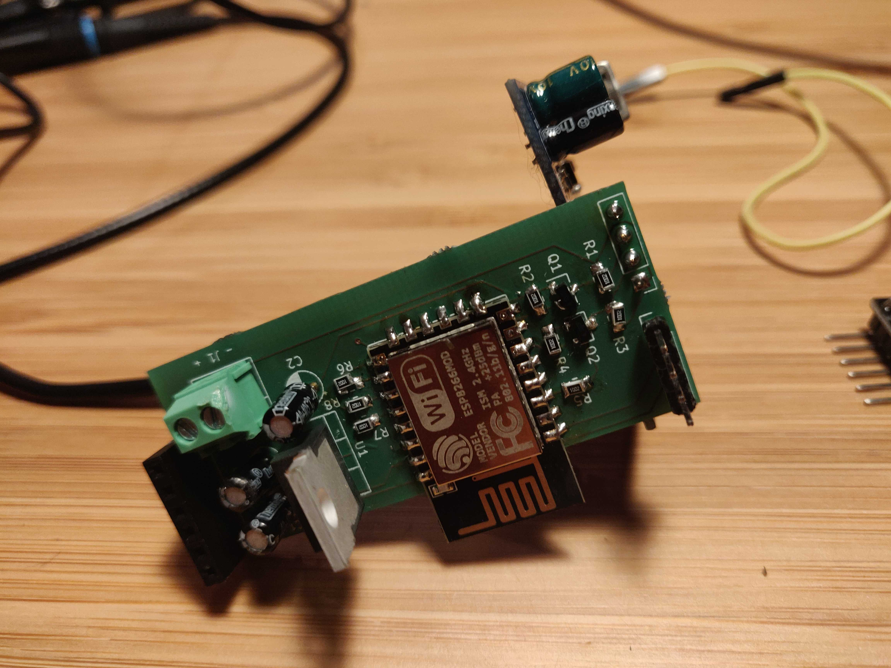
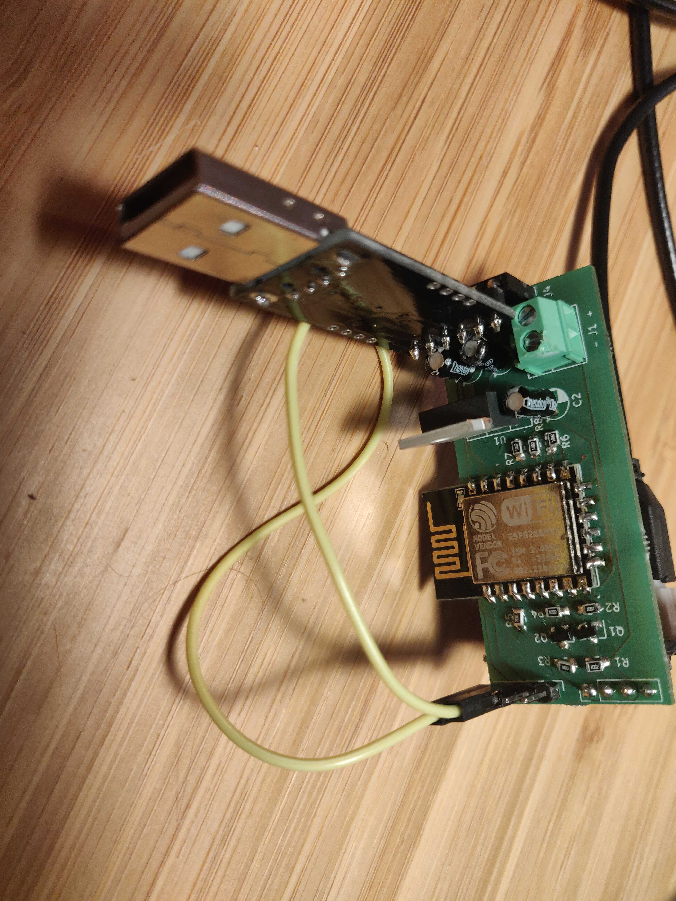

# About

This is a simple breakout for an ESP12MOD module that enables easy connection to a 5V power supply and that converts 2 IOs to 5V levels, suitable for connecting an acoustic waterlevel sensor.

The software reads the acoustic waterlevel sensor 30 times and sends the median value via MQTT.

# The hardware

Following components are needed:
* the pcb's (Aisler template is used in pcb/ folder, so easiest to order via aisler)
* an ESP12MOD module (the one with 22 pins!)
* A SR04M-2 acoustic sensor or equivalent
* A LM1117T linear regulator in a TO-220-3 package
* 8 10Kohm 0805 resistors
* 2 BSS138 mosfets in SOT-23 package
* A screw terminal block with 2 connections pitch 3.5mm
* A 0.1μF radial electrolytic capacitor, diameter 4mm, pitch 2mm
* 2 10μF radial electrolytic capacitors, diameter 4mm, pitch 2mm
* female pin header, 6 pins, 2.54mm pitch
* male pin header, 4 pins, 2.54mm pitch for reset/program jumper (optional)
* a jumper or a jumper cable (optional)

To connect the acoustic sensor, note that the `TRG` pin might be called `RX`
and the `ECHO` pin might be called `TX`. This is because some boards can be
configured to operate in serial mode by adding a resistor.

# Uploading the firmware

Use platformIO to build it. To upload it, ground the "PRG" pin on the board by connecting a jumper between the PRG and the GND pins, and connect a FTDI module to the female pin header (check the pin-out: 5V must match 5V and GND must match GND, and RX of the board must be connected with TX of the FTDI and vice versa).

After connecting the module, uploading the software should be possible with control-shift-P

# Configuring the firmware

Unplug the programming jumper and supply 5V or connect the FTDI again (the PCB can take power from the FTDI, but make sure to unplug/replug to trigger a reboot after programming). Now an access point should become availabe. Connect to it with your android phone, a web interface will pop up where you can set the wifi parameters and the mqtt server.

Write down the chip ID (which is equal to the access point name). After configuration is done the chip will connect to the MQTT server and it will publish some topics:

* `/[chip_id]/online` will contain the number of iterations since boot-up, or will equal "0" if the module is offline
* `/[chip_id]/state` will contain the distance

Every time information is sent to MQTT, the LED will flash briefly 3 times.

# Firmware factory reset

Power up the firmware, and *while powered up* connect a jumper between PRG and GND pins. The blue LED will immediately blink 10 times and all settings will be cleared.
